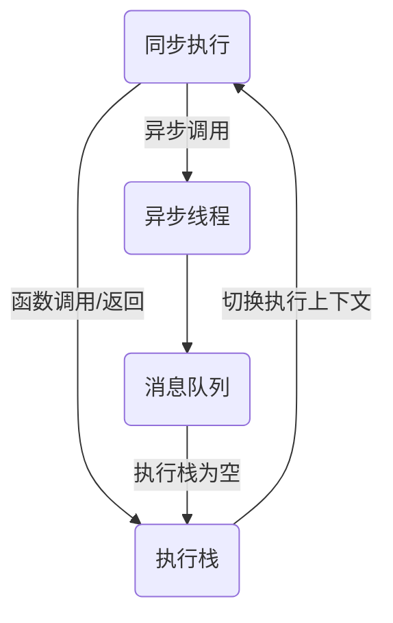
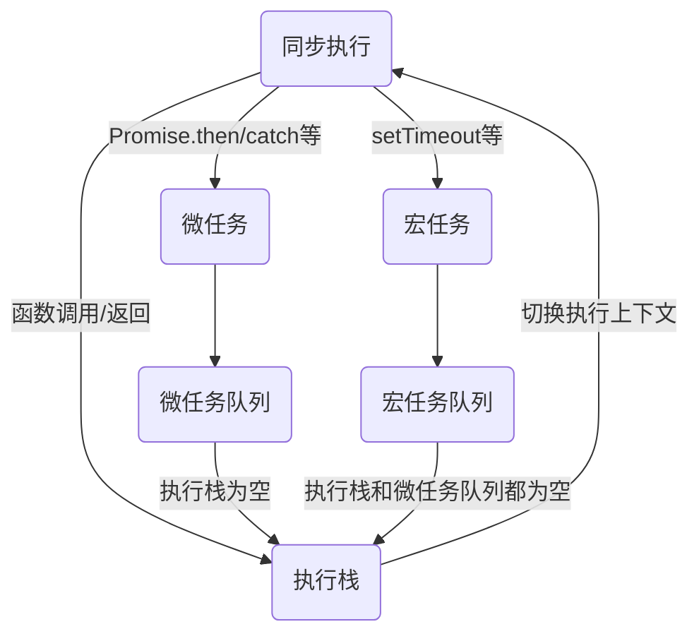

# Event Loop

## 浏览器进程与线程

JS 是单线程的

进程：资源分配的最小单位

线程：CPU 调度的最小单位

一个进程可以包含多个线程，进程内的线程共享进程资源

Chrome 浏览器采用多进程架构模型，其包含有：浏览器进程、渲染进程、GPU 进程、插件进程等

渲染进程包含：GUI 渲染线程、JS 引擎线程、事件触发线程、定时器触发线程、异步 HTTP 请求线程、Web Worker 线程

GUI 渲染线程与 JS 引擎线程是互斥的，所以 JS 代码执行会阻塞页面渲染

```
HTML ->  DOM  --┐
                │─> Render Tree -> Layout -> Paint
CSS  -> CSSOM --┘

Bytes -> Characters -> Token -> Node -> DOM/CSSOM

DOM：解析 HTML，生成 DOM 树
CSSOM：解析 CSS，生成 CSSOM 树
Render Tree：合并 DOM 和 CSSOM ，计算最终样式，将不可见的节点剔除，仅保留可见节点，生成 Render Tree
Layout：遍历 Render Tree ，计算节点在浏览器最终展示的位置和大小信息，即（x, y, w, h）
Paint：遍历 Layout Tree ，确定绘制顺序，创建绘制记录（Paint Records）
Layer：遍历 Layout Tree ，创建图层层树（Layer Tree）
Composite：合成器线程栅格化各个图层，然后创建合成帧，再发送给 GPU 渲染

Reflow：布局属性（位置、大小等）发生变动时触发
Repaint：非布局属性（背景颜色、字体样式、透明度等）发生变动时触发
```

异步非阻塞：JS 代码在 JS 引擎线程上同步执行，当遇到异步调用时，将异步任务发送给异步线程处理，同时代码往下继续执行，直至结束。而异步线程中的异步任务处理完成后，其回调函数将会被放入消息队列中，等待 JS 引擎线程空闲时执行

## 堆、执行栈、任务队列

```
   ┌──────────────────────┐ ┌───────┐
   │ Heap                 │ │ Stack │          Web APIs
   │             ┌──┐     │ │       │       ┌────────────┐
   │   ┌──┐      └──┘     │ │┌─────┐│       │    DOM     │
   │   └──┘         ┌──┐  │ │└─────┘│       │────────────│
   │        ┌──┐    └──┘  │ │┌─────┐│  ──>  │    Ajax    │
   │        └──┘          │ │└─────┘│       │────────────│
   │     ┌──┐             │ │┌─────┐│       │ setTimeout │
   │     └──┘             │ │└─────┘│       └────────────┘
   └──────────────────────┘ └───────┘             │
                                ∧                 │
                                │                 │
   ┌────────────────────────────────┐             │
   │┌───┐┌───┐┌───┐          Queue  │  <──────────┘
   │└───┘└───┘└───┘                 │
   └────────────────────────────────┘
```

### 堆

表示一大块（通常是非结构化的）内存区域，用来存储对象

### 执行栈

函数调用形成的一个由若干帧（作用域）组成的栈

### 任务队列

待处理的消息队列，每一个消息都关联着一个用于处理此消息的回调函数

### 执行过程



1. 代码同步执行
2. 当遇到函数调用时，将函数的执行上下文压入执行栈，然后切换到此执行上下文，继续执行
3. 函数执行完毕返回时，执行栈弹出执行上下文，并切换到之前的执行上下文再继续执行
4. 当遇到异步调用时，将异步任务交给异步线程处理，代码继续往下执行
5. 异步线程处理完异步任务后，将消息发送给消息队列，等待执行栈为空时，弹出消息队列中的第一个待处理消息，并执行其回调函数

### 执行过程示例

```js
function stack1(stack) {
  stack2(stack);
}

function stack2(stack) {
  console.trace('---------' + stack);
}

setTimeout(() => {
  stack1('setTimeout');
}, 0);

stack1('global');
```

输出：

```
---------global
stack2      @ VM61:6
stack1      @ VM61:2
(anonymous) @ VM61:13

---------setTimeout
stack2      @ VM61:6
stack1      @ VM61:2
(anonymous) @ VM61:10
setTimeout (async)
(anonymous) @ VM61:9
```

## 宏任务、微任务

宏任务：setTimeout、setInterval、setImmediate、I/O、UI Rendering

微任务：Promise.then/catch、Process.nextTick、MutationObserver

浏览器环境内，每执行一次宏任务类型的异步调用，就创建一个新的宏任务

在一次执行阶段内，只有全部的微任务执行完毕后才会进入下一阶段的宏任务

```
   ┌───────┐                                  Macro Task
   │ Stack │                               ┌──────────────┐
   │       │  ─────────────────────────>   │  setTimeout  │
   │┌─────┐│                               │──────────────│
   │└─────┘│              Micro Task       │  setInterval │
   │┌─────┐│       ┌────────────────────┐  │──────────────│
   │└─────┘│       │ Promise.then/catch │  │ setImmediate │
   │┌─────┐│       │────────────────────│  │──────────────│
   │└─────┘│  ──>  │  Process.nextTick  │  │     I/O      │
   │┌─────┐│       │────────────────────│  │──────────────│
   │└─────┘│       │  MutationObserver  │  │ UI Rendering │
   └───────┘       └────────────────────┘  └──────────────┘
       ∧                     │                    │
       │                     ∨                    │
       │   ┌────────────────────────────────┐     │
       │─  │┌───┐┌───┐┌───┐     Micro Queue │     │
       │   │└───┘└───┘└───┘                 │     │
       │   └────────────────────────────────┘     │
       │   ┌────────────────────────────────┐     │
       └─  │┌───┐┌───┐┌───┐     Macro Queue │  <──┘
           │└───┘└───┘└───┘                 │
           └────────────────────────────────┘
```



1. 同步执行
2. 函数调用/返回时，将执行上下文压入/弹出执行栈，并切换执行上下文，继续执行代码
3. 遇到微任务调用时，将微任务交给相应的异步线程处理，完成后将其回调方法放入微任务队列等待执行
4. 遇到宏任务调用时，将宏任务交给相应的异步线程处理，完成后将其回调方法放入宏任务队列等待执行
5. 当执行栈为空时，检查微任务队列，如果有微任务回调等待执行，将其执行上下文压入执行栈，切换执行上下文后开始执行（返回第 1 步）
6. 当执行栈为空，并且微任务队列也为空时，检查宏任务队列，如果有宏任务回调等待执行，将其执行上下文压入执行栈，切换执行上下文后开始执行（返回第 1 步）

### 执行过程示例

```js
function stack1(stack) {
  stack2(stack);
}

function stack2(stack) {
  console.trace('---------' + stack);
}

setTimeout(() => {
  stack1('setTimeout');
}, 0);

Promise.resolve().then(() => {
  stack1('Promise1');
});

stack1('global');
```

输出：

```
---------global
stack2      @ VM47:6
stack1      @ VM47:2
(anonymous) @ VM47:17

---------Promise1
stack2      @ VM47:6
stack1      @ VM47:2
(anonymous) @ VM47:14
Promise.then (async)
(anonymous) @ VM47:13

---------setTimeout
stack2      @ VM47:6
stack1      @ VM47:2
(anonymous) @ VM47:10
setTimeout (async)
(anonymous) @ VM47:9
```

## Node Event Loop

```
   ┌───────────────────────────┐
┌─>│           timers          │
│  └─────────────┬─────────────┘
│  ┌─────────────┴─────────────┐
│  │     pending callbacks     │
│  └─────────────┬─────────────┘
│  ┌─────────────┴─────────────┐
│  │       idle, prepare       │
│  └─────────────┬─────────────┘      ┌───────────────┐
│  ┌─────────────┴─────────────┐      │   incoming:   │
│  │           poll            │<─────┤  connections, │
│  └─────────────┬─────────────┘      │   data, etc.  │
│  ┌─────────────┴─────────────┐      └───────────────┘
│  │           check           │
│  └─────────────┬─────────────┘
│  ┌─────────────┴─────────────┐
└──┤      close callbacks      │
   └───────────────────────────┘
```

> 注意：每个框被称为事件循环机制的一个阶段。

timers：执行 setTimeout、setInterval 调度的回调函数

pending callbacks：执行上次循环延迟的 I/O 回调

idle, prepare：仅系统内部使用

poll：检索新的 I/O 事件；执行与 I/O 相关的回调（几乎所有的情况，除了关闭的回调函数、计时器和 setImmediate()调度的之外）；其余情况 Node 将在适当的时候在此阻塞

check：执行 setImmediate 调度的回调函数

close callbacks：一些关闭的回调函数，如：socket.on('close', ...)

Node 环境内，同一次执行栈执行时创建的所有宏任务异步回调，都放在后续的 Event Loop 的各个阶段内，并在进入相应阶段时，按照创建的先后顺序同步执行

Node 环境内，只有在执行完同一 Event Loop 阶段内的所有宏任务之后，才开始执行微任务队列的任务

## 参考

- [The Node.js Event Loop, Timers, and process.nextTick()](https://nodejs.org/en/docs/guides/event-loop-timers-and-nexttick/)
- [图解浏览器的基本工作原理](https://zhuanlan.zhihu.com/p/47407398)
